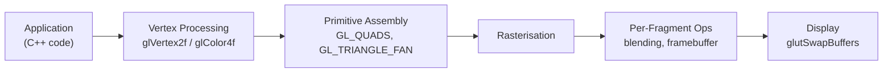
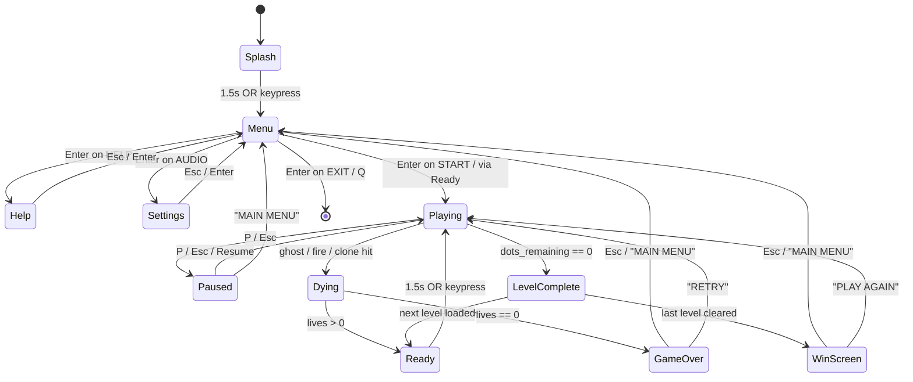
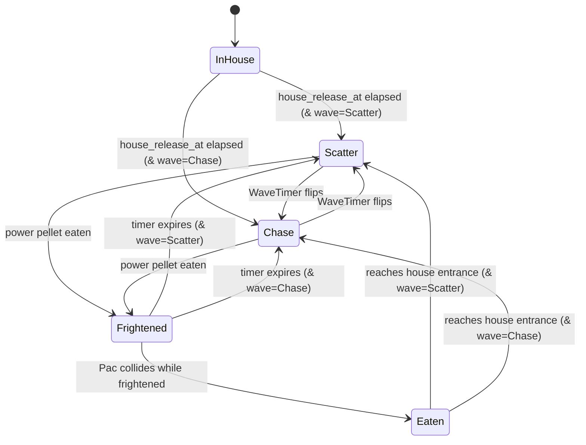
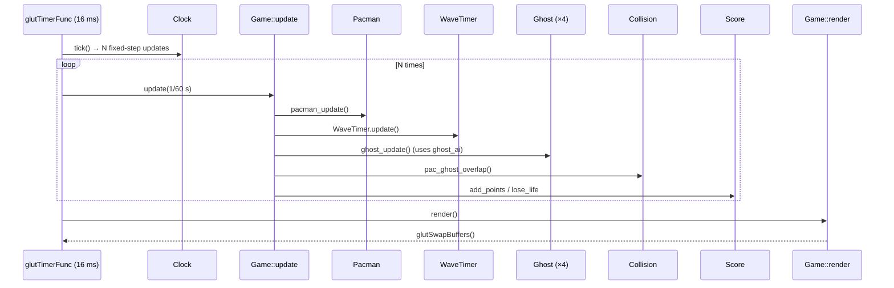
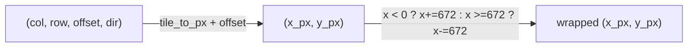
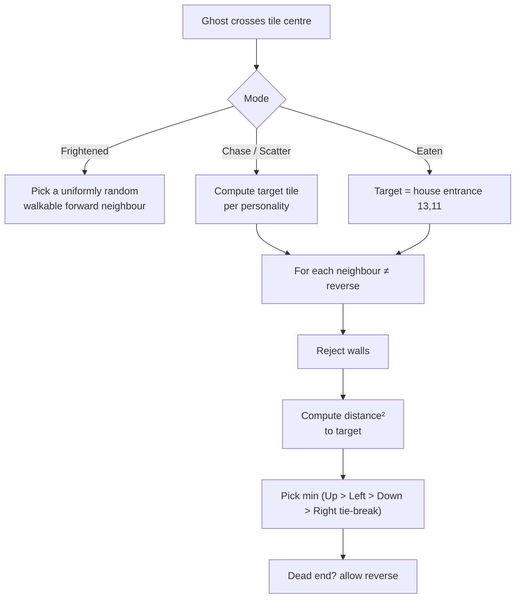
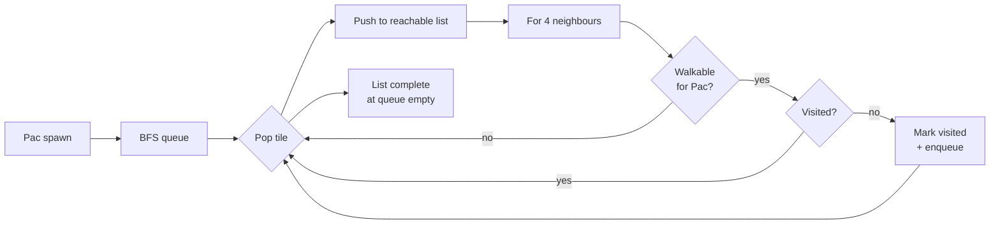
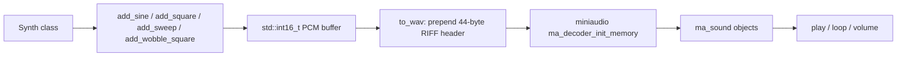

# Pac-Man — A freeglut + C++17 Implementation

**CSE 426 — Computer Graphics Lab Term Project**
**Course:** CSE 426 (Computer Graphics Lab), Fall 2025
**Authors:** Sharif, Priom & Ovi
**Submitted to:** Course Teacher, CSE 426
**Date:** 17 May 2026

---

## Table of Contents

1. [Introduction](#1-introduction)
2. [System Design & Architecture](#2-system-design--architecture)
3. [Implementation](#3-implementation)
4. [Results & Output](#4-results--output)
5. [Conclusion with Future Scope](#5-conclusion-with-future-scope)
6. [References](#6-references)
7. [Appendices](#7-appendices)

---

# 1. Introduction

## 1.1 Problem Statement

Implement a faithful clone of the 1980 Namco arcade title **Pac-Man** entirely on the **fixed-function OpenGL 1.x** pipeline exposed by **freeglut**, using only standard C++17, with no external game engine, no scene graph, and no shader-based pipeline. The game must:

- render a 28 × 31 tile maze, animated player and four ghosts, dots, power pellets, fruit, HUD, and full menu / pause / game-over flow at 60 frames per second,
- implement the four ghosts' canonical personality-based AI (Blinky, Pinky, Inky, Clyde),
- support a full **state machine** (Splash → Menu → Help → Settings → Ready → Playing → Paused → Dying → Level Complete → Game Over / Win),
- ship with **three hand-designed levels** and per-level difficulty scaling,
- persist hi-score and audio preferences across runs,
- bundle all third-party dependencies (freeglut, miniaudio, stb_image) inside the repository so that *any* teammate can `git clone && build` on a stock MinGW-W64 toolchain with zero system-level setup.

## 1.2 Project Motivation

Pac-Man is the *Hello, World!* of game programming because it pulls in every classic 2-D graphics topic in a single, very small package:

| Topic                              | Where it shows up in Pac-Man                          |
|------------------------------------|-------------------------------------------------------|
| Coordinate systems & transforms    | Tile (col,row,offset) ↔ pixel (x,y), ortho projection |
| Rasterised primitives              | Walls, dots, pellets, HUD bars, particles             |
| Procedural shape construction      | Pac-mouth wedge, ghost body, fruit, perk icons        |
| 2-D animation                      | Mouth chomp (rectified sine), ghost wobble, pellet pulse |
| Game-state finite automata         | 11-state global FSM + per-ghost mode FSM              |
| AI / target-tile search            | Greedy squared-Euclidean direction picker             |
| Pathfinding                        | BFS over reachable tiles for perk spawn placement     |
| Procedural audio                   | Chiptune SFX synthesised in-memory at boot            |
| User interface                     | Splash, menu, settings, pause, game-over, HUD         |
| Persistence                        | `%APPDATA%/pacman-freeglut/savedata.txt` for hi-score       |
| Letterboxed full-screen            | Aspect-preserving viewport in `on_reshape`            |

Choosing freeglut keeps the project squarely in the territory the lab manual targets — **immediate-mode OpenGL** — while still allowing us to demonstrate that we can build a complete, polished interactive program.

## 1.3 Background of Computer Graphics

### 1.3.1 The graphics pipeline (fixed-function era)

The fixed-function OpenGL 1.x pipeline as exposed through freeglut consists of five conceptual stages:



We use immediate mode (`glBegin` / `glVertex2f` / `glEnd`) throughout — no VBOs, no shaders. This is the historical "teaching" pipeline of OpenGL and exactly what the CSE 426 syllabus targets.

### 1.3.2 Orthographic projection for 2-D games

A 2-D game does not need perspective; instead we set:

```c
gluOrtho2D(0, kWindowWidth, kWindowHeight, 0);
```

Note the flipped Y axis: passing `(0, h, 0)` instead of `(0, 0, h)` makes the origin **top-left**, matching screen / pixel intuition.

### 1.3.3 Alpha blending

Translucent overlays (pause dimming, splash fade, screen tint while a perk is active) rely on:

```c
glEnable(GL_BLEND);
glBlendFunc(GL_SRC_ALPHA, GL_ONE_MINUS_SRC_ALPHA);
```

This is the standard "src-over" Porter–Duff equation. Disabling depth testing is correct for a strict 2-D scene where painter's-order is enforced by the code.

### 1.3.4 Why "tile based"?

Classic arcade Pac-Man stores the world as a 28 × 31 grid of 8 × 8-pixel tiles. We use 24 × 24-pixel tiles (giving a 672 × 744 play area, large enough for crisp HUD readability on modern monitors). The benefits of tile-based design:

- decisions (turns, dot pickups, collisions) happen at tile boundaries — no float drift,
- collision detection collapses to integer comparisons,
- level data fits in an ASCII text file editable in any text editor,
- ghost AI can reason in *tiles* (the historical convention) instead of pixels.

## 1.4 Scope and Targets

| Mark band                  | Marks | Status      |
|----------------------------|-------|-------------|
| Base game (movement, ghosts, scoring, HUD) | 20 | Implemented |
| Menu                       | 5     | Implemented |
| Pause / Exit               | 5     | Implemented |
| Creativity (perks, combos, particles, screen-shake, fruits, multiple levels, audio settings, persistence) | 15 | Implemented |
| **Total target**           | **45** | **Implemented** |

---

# 2. System Design & Architecture

## 2.1 High-level module map

```mermaid
graph TB
    subgraph entry[Entry]
        MAIN["main.cpp"]
        APP["core/app.cpp<br>(GLUT bootstrap)"]
    end

    subgraph core[Core]
        GAME["core/game.cpp<br>(state machine)"]
        CLOCK["core/clock.cpp<br>(60 Hz fixed-step)"]
        STATE["core/state.h<br>(enum GameState)"]
    end

    subgraph world[World]
        TILE["world/tile.h<br>(grid constants)"]
        MAZE["world/maze.cpp<br>(tile array + dot count)"]
        LOAD["world/level_loader.cpp<br>(ASCII parser)"]
        PATH["world/pathfind.h<br>(distance²)"]
    end

    subgraph play[Gameplay]
        PAC["gameplay/pacman.cpp"]
        GH["gameplay/ghost.cpp"]
        AI["gameplay/ghost_ai.cpp"]
        MODES["gameplay/modes.cpp<br>(Wave timer)"]
        COL["gameplay/collision.cpp"]
        SCORE["gameplay/score.cpp"]
        FRUIT["gameplay/fruit.cpp"]
        PERK["gameplay/perks.cpp"]
        COMBO["gameplay/combo.cpp"]
    end

    subgraph render[Render]
        GL["render/gl_init.cpp"]
        PRIM["render/primitives.cpp"]
        TEXT["render/text.cpp"]
        PART["render/particles.cpp"]
        CAM["render/camera.cpp<br>(shake)"]
    end

    subgraph ui[UI]
        MENU["ui/menu.cpp"]
        HELP["ui/help.cpp"]
        HUD["ui/hud.cpp"]
        PAUSE["ui/pause.cpp"]
        GOVR["ui/gameover.cpp"]
    end

    subgraph io[I/O]
        IN["input/input.cpp"]
        AUD["audio/audio.cpp<br>(miniaudio synth)"]
        FILE["util/file.cpp"]
    end

    MAIN --> APP
    APP --> GAME
    APP --> CLOCK
    APP --> IN
    APP --> AUD
    APP --> GL
    GAME --> STATE
    GAME --> MAZE
    GAME --> PAC
    GAME --> GH
    GAME --> SCORE
    GAME --> FRUIT
    GAME --> PERK
    GAME --> COMBO
    GAME --> MODES
    GAME --> COL
    GAME --> HUD
    GAME --> MENU
    GAME --> HELP
    GAME --> PAUSE
    GAME --> GOVR
    GAME --> PART
    GAME --> CAM
    GAME --> FILE
    GH --> AI
    AI --> PATH
    MAZE --> TILE
    LOAD --> MAZE
    LOAD --> FILE
    PAC --> IN
    HUD --> PRIM
    HUD --> TEXT
    MENU --> PRIM
    MENU --> TEXT
```



**Design principle:** plain structs + free functions for actor data (`Pacman`, `Ghost`); a single class (`core::Game`) owns the state machine and per-frame dispatch. No virtual dispatch except where the problem genuinely needs it (it doesn't — we have no abstract base classes).

## 2.2 Global state machine

The top-level `core::Game` runs one of 11 states each frame:



Source: [src/core/state.h](../src/core/state.h), transitions live in [src/core/game.cpp](../src/core/game.cpp).

## 2.3 Per-ghost mode finite-state machine

Independently of the global state, each ghost has its own mode:



Source: [src/gameplay/ghost.h](../src/gameplay/ghost.h) (enum `GhostMode`), transitions in [src/gameplay/ghost.cpp](../src/gameplay/ghost.cpp).

## 2.4 Per-frame data flow



## 2.5 Coordinate model

Every actor uses **(col, row, offset)** — `(col,row)` is an integer tile, `offset ∈ [0,1)` is the fraction of the way into the *next* tile in the current direction. Pixel position is reconstructed at render time:

```
x_px = col*24 + 12 + offset*24*dx(dir)
y_px = row*24 + 12 + offset*24*dy(dir)
```

with tunnel wrap on the horizontal axis. This avoids floating-point drift and makes "am I at a tile centre?" a single integer check (`offset == 0`).



Source: `pacman_x_px` / `pacman_y_px` in [src/gameplay/pacman.cpp:155-172](../src/gameplay/pacman.cpp#L155-L172).

## 2.6 Algorithms used

### 2.6.1 Greedy direction picker (ghost AI)

Classic arcade Pac-Man does **not** use A* or BFS for the ghosts. Each ghost has a single *target tile* that depends on its personality, and at every tile boundary it picks the **walkable neighbouring tile (excluding reverse) that minimises squared Euclidean distance to that target**, breaking ties in the priority order **Up → Left → Down → Right** (strict `<`).



Source: `greedy_pick` in [src/gameplay/ghost_ai.cpp:107-147](../src/gameplay/ghost_ai.cpp#L107-L147).

### 2.6.2 Per-ghost target-tile policies

| Ghost  | Scatter target       | Chase target                                                                              |
|--------|----------------------|-------------------------------------------------------------------------------------------|
| Blinky | (25, -3) top-right   | Pac's tile (direct chase)                                                                  |
| Pinky  | (2, -3) top-left     | 4 tiles ahead of Pac in Pac's facing direction                                             |
| Inky   | (27, 31) bot-right   | Reflect (2 tiles ahead of Pac) through Blinky's position, then double                      |
| Clyde  | (0, 31) bot-left     | If distance to Pac > 8 tiles: chase directly; else: retreat to scatter corner              |

Source: [src/gameplay/ghost_ai.cpp:35-86](../src/gameplay/ghost_ai.cpp#L35-L86).

### 2.6.3 BFS for perk-spawn reachability

The perk pickup must spawn on a tile that Pac can actually reach (not inside a wall and not inside the ghost-house). We run a **breadth-first search** from Pac's spawn through `walkable_for_pac` neighbours **once at level load** and cache the packed `(col*31 + row)` list. The perk spawner picks a uniformly random tile from this list, then rejects any choice within 3 Manhattan tiles of Pac (so a perk never materialises on top of him).



Source: `Game::compute_reachable_tiles` in [src/core/game.cpp:286-331](../src/core/game.cpp#L286-L331).

### 2.6.4 Scatter / chase wave timer

A single global `WaveTimer` toggles all (non-frightened, non-eaten) ghosts between Scatter and Chase on the arcade-classic schedule **7 → 20 → 7 → 20 → 5 → 20 → 5 → Chase-forever** seconds. When the wave flips, every active ghost receives a `pending_reverse` flag — the next update applies a mid-tile 180° turn, which is the **canonical visual signal that the wave changed**.

Source: [src/gameplay/modes.cpp](../src/gameplay/modes.cpp).

### 2.6.5 Combo / chain multiplier

Dots eaten within 0.4 s of the previous dot increment a chain counter; the multiplier ramps linearly at +0.1 per link, capped at ×3.0 at chain ≥ 21.

```
multiplier = clamp(1.0 + 0.1·(chain - 1), 1.0, 3.0)
```

Source: `combo_multiplier` in [src/gameplay/combo.h:25-30](../src/gameplay/combo.h#L25-L30).

### 2.6.6 Fixed-step accumulator

Wall-clock dt is accumulated; the gameplay update is run an integer number of times at `1/60 s` per call. Rendering runs once per render frame regardless of update count. This decouples physics from frame-rate so behaviour is identical at 60 Hz and 144 Hz.

Source: `Clock::tick` in [src/core/clock.cpp](../src/core/clock.cpp).

### 2.6.7 Aspect-preserving letterbox

On any window resize (including full-screen toggle), we compute the largest sub-rect of the window that matches the canonical 672:824 aspect ratio and call `glViewport` with it. Letterbox / pillarbox bars come for free because the surrounding framebuffer is cleared to black.

Source: `render::on_reshape` in [src/render/gl_init.cpp:43-70](../src/render/gl_init.cpp#L43-L70).

### 2.6.8 Procedural audio synthesis

No `.wav` files ship with the game. At boot, `audio::init()` generates the eight SFX *and* the 4-second looping BGM into in-memory PCM buffers, wraps them in RIFF/WAVE headers, and hands the byte vectors to **miniaudio** decoders. Each SFX is a hand-written combination of sine waves, square waves, linear sweeps, and silences.



Source: [src/audio/audio.cpp](../src/audio/audio.cpp) — `Synth` class lines 53–179, per-SFX patches lines 185–249.

---

# 3. Implementation

## 3.1 Project environment

| Aspect                   | Value                                                         |
|--------------------------|---------------------------------------------------------------|
| Language                 | C++17 (no exceptions across module boundaries)                |
| Build                    | CMake 4.1.0 + MinGW-W64 `g++` 15.2.0                          |
| Graphics                 | freeglut 3.x (bundled in `thirdparty/freeglut/`) + OpenGL 1.x |
| Image loading            | `stb_image.h` (vendored; currently unused — reserved for atlas)|
| Audio                    | `miniaudio.h` (vendored single-header), Win32 `winmm` backend |
| Persistence              | `%APPDATA%/pacman-freeglut/savedata.txt` (key=value pairs)          |
| Platform                 | Windows 11 (x64), 60 Hz fixed-step game loop                  |
| Warnings                 | `-Wall -Wextra -Wpedantic -Wshadow -Wconversion`              |

**Build:**

```bash
cmake -G "MinGW Makefiles" -S . -B build
cmake --build build -j
./build/bin/pacman.exe
```

A `POST_BUILD` step copies `libfreeglut.dll` and the entire `assets/` directory next to `pacman.exe` so the binary runs with relative paths (`assets/levels/level_01.txt`).

## 3.2 Major modules / components

### 3.2.1 `core/` — bootstrap, clock, and the state machine

- **app.cpp** — wires GLUT callbacks (`glutDisplayFunc`, `glutTimerFunc`, the four `Keyboard*Func`'s, `glutCloseFunc`) to a single shared `Game` instance. Manages full-screen toggle and FPS reporting.
- **clock.cpp** — fixed-timestep accumulator at 60 updates per second with `kFixedDt = 1.0/60.0`. Returns the integer number of update steps to run this frame.
- **game.cpp** — the heart of the program (≈1500 lines, the only deliberately-large file). Holds every actor, the maze, the wave timer, every per-state update method, every per-state render method, and the perk / Blinky-fire / Clyde-clone P10 systems.

### 3.2.2 `world/` — maze model

- **tile.h** — single source of truth for `kCols = 28`, `kRows = 31`, `kTileSize = 24`. Coordinate conversions are inline.
- **maze.cpp** — fixed-size `std::array<TileType, 28*31>` of tile classifications + a `Spawns` struct + a live `dots_remaining` counter. `eat_at(col,row)` is how Pac picks up dots.
- **level_loader.cpp** — parses one ASCII grid into a `Maze`. Glyphs: `#` wall, `.` dot, `o`/`O` power pellet, `-`/`_` ghost door, `P` Pac spawn, `B`/`N`/`I`/`C` Blinky/piNky/Inky/Clyde spawns, space = empty corridor.

### 3.2.3 `gameplay/` — actor systems

| File          | Responsibility                                                         |
|---------------|------------------------------------------------------------------------|
| `pacman.cpp`  | Pac movement, input-buffer turn logic, U-turn, mouth chomp render      |
| `ghost.cpp`   | Per-ghost step, mode-dependent speed multiplier, body + eyes rendering |
| `ghost_ai.cpp`| Target-tile policy + greedy direction picker + frightened-random picker|
| `modes.cpp`   | Global `WaveTimer` (scatter / chase 7-20-7-20-5-20-5)                  |
| `collision.cpp`| `pac_ghost_overlap()` — pixel distance² < 14²                         |
| `score.cpp`   | Points, lives, level, hi-score                                         |
| `fruit.cpp`   | Per-level fruit spawn after 70 / 170 dots eaten; 9 s lifetime          |
| `perks.cpp`   | Freeze / Speed / Invisibility — colours, durations, icon drawing       |
| `combo.cpp`   | Eat-chain multiplier + floating "+10 ×1.4" popups                      |

### 3.2.4 `render/` — drawing primitives

- **gl_init.cpp** — one-time GL state (`glClearColor` black, blend enabled, depth disabled, ortho 2-D projection). Also the letterbox `on_reshape`.
- **primitives.cpp** — `set_color`, `draw_quad`, `draw_line` (as a thin quad, for predictable thickness across drivers), `draw_filled_circle` (`GL_TRIANGLE_FAN`).
- **text.cpp** — wraps `glutBitmapCharacter(GLUT_BITMAP_HELVETICA_18, …)` with width helper and `draw_text_centered`.
- **particles.cpp** — module-local `std::vector<Particle>` of up to ~256, with `emit_sparkle / burst / ring / dissolve`, gravity, alpha-fade-out.
- **camera.cpp** — screen-shake `(g_ox, g_oy)` offset that decays linearly to zero over its lifetime.

### 3.2.5 `ui/` — screens

| File           | Screen                                                       |
|----------------|--------------------------------------------------------------|
| `menu.cpp`     | Splash-style main menu with heartbeat-pulsing selected item  |
| `help.cpp`     | Controls table + ghost-legend table with mini-ghost icons    |
| `hud.cpp`      | Bottom-80px strip: score, hi-score, level, lives, time, perk |
| `pause.cpp`    | Translucent dim + Resume / Main Menu                         |
| `gameover.cpp` | Red "GAME OVER" or green "YOU WIN!" panel with retry / menu  |

### 3.2.6 `input/`, `audio/`, `util/`

- **input.cpp** — converts GLUT `Keyboard*Func` callbacks into a single shared `State` struct with edge-triggered `press_*` flags (cleared at end-of-frame).
- **audio.cpp** — chiptune synthesis (see §2.6.8) + miniaudio glue + per-channel volume.
- **util/file.cpp** — `asset_path()` (relative to the exe dir, not cwd), `appdata_path()` (Windows `%APPDATA%`), read / write text helpers for save data.

## 3.3 Visual aesthetics & decorative elements

| Element                       | Where                                         | What it does                                                            |
|-------------------------------|-----------------------------------------------|-------------------------------------------------------------------------|
| Pulsing power pellets         | [game.cpp:1506-1517](../src/core/game.cpp#L1506-L1517) | `radius = 6 + 1.5·sin(t·3.6)` — gentle 0.6 Hz heartbeat                 |
| Pulsing menu selection        | [menu.cpp:40-43](../src/ui/menu.cpp#L40-L43)  | Brightness multiplier `0.85 + 0.15·sin(t·6)`                            |
| Ghost frightened white-flash  | [ghost.cpp:227-232](../src/gameplay/ghost.cpp#L227-L232) | Last 2 s of frightened mode alternates blue/white at ~3 Hz             |
| Camera shake on death         | [camera.cpp](../src/render/camera.cpp), triggered in [game.cpp:712](../src/core/game.cpp#L712) | 8 px magnitude, 0.3 s linear decay                                      |
| Particle dissolve on death    | [game.cpp:709-711](../src/core/game.cpp#L709-L711) | 30 particles burst from Pac with gravity                                |
| Sparkle on every dot eaten    | [game.cpp:997](../src/core/game.cpp#L997)     | 4-particle ring outward                                                  |
| Floating score popups         | [combo.cpp](../src/gameplay/combo.cpp), called from many places | "+10 ×1.4" drifts up & fades                                            |
| Splash fade-in/out triangle   | [game.cpp:1342-1379](../src/core/game.cpp#L1342-L1379) | `alpha = t<0.5 ? 2t : 2(1-t)` triangular envelope                       |
| READY! banner sine wobble     | [game.cpp:1332-1340](../src/core/game.cpp#L1332-L1340) | `0.85 + 0.15·sin(t·18)` ~3 Hz alpha wobble                              |
| Ghost-house door fade-on-exit | [game.cpp:1476-1488](../src/core/game.cpp#L1476-L1488) | Door alpha ramps from 0 → 1 over 0.5 s after a ghost is released        |
| Perk-on-map icon pulse        | [game.cpp:1313-1320](../src/core/game.cpp#L1313-L1320) | `radius_mul = 1 + 0.1·sin(t·6)`                                          |
| Screen tint while perk active | [game.cpp:1322-1330](../src/core/game.cpp#L1322-L1330) | Translucent full-screen quad in perk's signature colour                  |
| Blinky telegraph halo         | [game.cpp:1242-1251](../src/core/game.cpp#L1242-L1251) | Red translucent disc grows around Blinky 0.5 s before his fire burst   |
| Wall outline (edge-aware)     | [game.cpp:94-107](../src/core/game.cpp#L94-L107) | Each wall tile draws only the four edges that face *non-wall* neighbours |

## 3.4 Important code snippets

### 3.4.1 The Pac-Man wedge (procedural mouth animation)

Drawn as a `GL_TRIANGLE_FAN` whose arc *omits* the mouth wedge around the facing direction:

```cpp
const float mouth_open = 0.5f - 0.5f * std::cos(p.anim_time * kChompHz * kTwoPi);
const float mouth_half = mouth_open * 0.45f;  // half-angle in radians
const float arc_start = center + mouth_half;
const float arc_end   = center + kTwoPi - mouth_half;

glBegin(GL_TRIANGLE_FAN);
glVertex2f(cx, cy);
for (int i = 0; i <= kSegments; ++i) {
    const float t = arc_start + (arc_end - arc_start) * i / kSegments;
    glVertex2f(cx + std::cos(t) * kPacRadius, cy + std::sin(t) * kPacRadius);
}
glEnd();
```

— [src/gameplay/pacman.cpp:181-202](../src/gameplay/pacman.cpp#L181-L202).

### 3.4.2 The greedy ghost direction picker

```cpp
Direction greedy_pick(const Ghost& g, const world::Maze& m, TargetTile target) {
    const Direction reverse = util::opposite(g.dir);
    constexpr Direction kCandidates[4] = {
        Direction::Up, Direction::Left, Direction::Down, Direction::Right,
    };

    Direction best = Direction::None;
    int best_dist = 0;
    for (Direction d : kCandidates) {
        if (d == reverse) continue;
        const int nc = g.col + util::dx(d);
        const int nr = g.row + util::dy(d);
        if (!walkable_with_wrap(m, nc, nr)) continue;

        const int dist_sq = world::distance_squared(nc, nr, target.col, target.row);
        if (best == Direction::None || dist_sq < best_dist) {
            best = d;
            best_dist = dist_sq;
        }
    }
    // Dead-end: allow reverse as a last resort.
    if (best != Direction::None) return best;
    if (reverse != Direction::None &&
        walkable_with_wrap(m, g.col + util::dx(reverse), g.row + util::dy(reverse))) {
        return reverse;
    }
    return Direction::None;
}
```

— [src/gameplay/ghost_ai.cpp:107-147](../src/gameplay/ghost_ai.cpp#L107-L147).

### 3.4.3 The four ghosts' chase-target expressions

```cpp
case GhostKind::Blinky:
    return {pac.col, pac.row};

case GhostKind::Pinky:
    return {pac.col + 4 * util::dx(pac.dir),
            pac.row + 4 * util::dy(pac.dir)};

case GhostKind::Inky: {
    const int piv_col = pac.col + 2 * util::dx(pac.dir);
    const int piv_row = pac.row + 2 * util::dy(pac.dir);
    const int dc = piv_col - blinky.col;
    const int dr = piv_row - blinky.row;
    return {piv_col + dc, piv_row + dr};
}

case GhostKind::Clyde: {
    const int dc = g.col - pac.col;
    const int dr = g.row - pac.row;
    if (dc * dc + dr * dr > 64) return {pac.col, pac.row};
    return scatter_target(GhostKind::Clyde);
}
```

— [src/gameplay/ghost_ai.cpp:51-86](../src/gameplay/ghost_ai.cpp#L51-L86).

### 3.4.4 Pac vs ghost collision

```cpp
bool pac_ghost_overlap(const Pacman& p, const Ghost& g) {
    const float dx = pacman_x_px(p) - ghost_x_px(g);
    const float dy = pacman_y_px(p) - ghost_y_px(g);
    return (dx*dx + dy*dy) < 14.0f * 14.0f;  // 14 px conservative radius
}
```

— [src/gameplay/collision.cpp:14-22](../src/gameplay/collision.cpp#L14-L22).

### 3.4.5 The win condition

```cpp
if (m_maze->dots_remaining() == 0) {
    audio::stop_bgm();
    enter_state(GameState::LevelComplete);
}
// ... later, when LevelComplete timer expires:
const int next = m_level_index + 1;
if (next >= kNumLevels) {
    enter_state(GameState::WinScreen);   // YOU WIN!
} else {
    load_level(next);
}
```

— [src/core/game.cpp:1083-1162](../src/core/game.cpp#L1083-L1162).

### 3.4.6 Power-pellet → frightened cascade

```cpp
if (base_pts == gameplay::Score::kPointsPerPellet) {  // == 50
    audio::play(audio::SfxId::PowerPellet);
    trigger_frightened();
    m_combo = gameplay::Combo{};
}
```

`trigger_frightened` flips every active ghost's mode, sets the frightened timer, and sets `pending_reverse` so they all visually U-turn.

— [src/core/game.cpp:428-437](../src/core/game.cpp#L428-L437).

### 3.4.7 Eat-ghost chain (doubling reward)

```cpp
if (g.mode == gameplay::GhostMode::Frightened) {
    const int chain_idx = (m_eat_chain < 4) ? m_eat_chain : 3;
    const int pts = 200 << chain_idx;       // 200, 400, 800, 1600
    m_score.add_points(pts);
    if (m_eat_chain < 4) ++m_eat_chain;
    g.mode = gameplay::GhostMode::Eaten;
}
```

— [src/core/game.cpp:1043-1067](../src/core/game.cpp#L1043-L1067).

### 3.4.8 Fixed-timestep tick

```cpp
int Clock::tick() {
    const double now = now_seconds();
    m_last_dt = now - m_prev_time;
    m_prev_time = now;
    m_accumulator += m_last_dt;
    int n = 0;
    while (m_accumulator >= kFixedDt && n < 4) {  // cap at 4 to break spirals
        m_accumulator -= kFixedDt;
        ++n;
    }
    return n;
}
```

— [src/core/clock.cpp](../src/core/clock.cpp).

## 3.5 Important graphics practices

1. **Painter's algorithm with depth disabled.** Layers are drawn back-to-front in code order: maze → fruit/perks → Pac → ghosts → particles → popups → screen-tint → HUD → overlays. No `GL_DEPTH_TEST`.
2. **Pre-multiplied modelview translate for screen-shake.** `glTranslatef(camera::offset_x(), …)` is pushed before world rendering, popped before HUD — so the shake never displaces the score.
3. **Immediate-mode primitives only.** Every shape is a fresh `glBegin`/`glEnd`. Acceptable because we draw ≤ ~200 primitives/frame.
4. **No `glLineWidth`.** Wall outlines are drawn as thin quads (rectangles) — line widths > 1 are notoriously driver-dependent in OpenGL 1.x.
5. **Letterbox in `on_reshape`.** The viewport is the largest centred sub-rect matching the 672:824 aspect; framebuffer clear paints the rest black.
6. **Single ortho projection.** `gluOrtho2D(0, 672, 824, 0)` — top-left origin matching screen / tile coordinates.
7. **Alpha blending always on.** Everything that fades uses `(GL_SRC_ALPHA, GL_ONE_MINUS_SRC_ALPHA)`.
8. **No new/delete in hot paths.** Particles, popups, and the reachable-tile cache use `std::vector` reserved once.

---

# 4. Results & Output

## 4.1 Key results

- **Full 11-state FSM operational** — every transition shown in §2.2 is exercised in regular play (Splash → Menu → Help → Settings → Ready → Playing → Paused → Dying → LevelComplete → GameOver → WinScreen → back to Menu).
- **Four distinct ghost personalities verified.** Blinky chases directly; Pinky leads; Inky flanks; Clyde dithers near 8 tiles.
- **Three hand-designed levels** load and complete cleanly. Per-level speed scaling: Pac +5 % / level, Ghosts +8 % / level, Frightened duration × 0.85 / level.
- **Persistent hi-score and audio volumes** survive a process restart via `%APPDATA%/pacman-freeglut/savedata.txt`.
- **No memory growth** observed across multiple plays — actor structs are stack-resident, particle / popup containers reuse capacity, the maze is a fixed-size array.
- **Steady 60 FPS** at the default 16 ms `glutTimerFunc` interval; the FPS counter logs `[pacman] fps=60 ups=60` every 5 seconds.

## 4.2 Screenshots (planned captures — populate before submission)

| Screenshot                  | What it shows                                                       | File location |
|-----------------------------|---------------------------------------------------------------------|---------------|
| `splash.png`                | 1.5 s splash fade with Pac wedge + title                            | `docs/screenshots/splash.png` |
| `main_menu.png`             | Main menu with pulsing START, hi-score footer                       | `docs/screenshots/main_menu.png` |
| `help_screen.png`           | Controls + ghost legend                                             | `docs/screenshots/help_screen.png` |
| `settings.png`              | Audio sliders (Master / SFX / BGM)                                  | `docs/screenshots/settings.png` |
| `playing_chase.png`         | Pac in mid-chase, all 4 ghosts active                               | `docs/screenshots/playing_chase.png` |
| `playing_frightened.png`    | Power pellet eaten — blue frightened ghosts                         | `docs/screenshots/playing_frightened.png` |
| `playing_fruit.png`         | Cherry / strawberry visible in centre corridor                      | `docs/screenshots/playing_fruit.png` |
| `playing_perk_freeze.png`   | Active Freeze perk — ice-blue screen tint + HUD timer bar           | `docs/screenshots/playing_perk_freeze.png` |
| `playing_blinky_fire.png`   | Blinky's telegraph halo / fire-burst tiles                          | `docs/screenshots/playing_blinky_fire.png` |
| `playing_clyde_clone.png`   | Translucent Clyde clone wandering                                   | `docs/screenshots/playing_clyde_clone.png` |
| `paused.png`                | Pause overlay with RESUME / MAIN MENU                               | `docs/screenshots/paused.png` |
| `ready_banner.png`          | "READY!" pulsing banner between lives                                | `docs/screenshots/ready_banner.png` |
| `level_complete.png`        | "LEVEL n CLEAR!" celebration                                        | `docs/screenshots/level_complete.png` |
| `game_over.png`             | Red "GAME OVER" panel with RETRY / MAIN MENU                        | `docs/screenshots/game_over.png` |
| `win_screen.png`            | Green "YOU WIN!" panel                                              | `docs/screenshots/win_screen.png` |

To capture them: run the binary, navigate to each state, press <kbd>Print Screen</kbd> or use Snip & Sketch (Win+Shift+S).

## 4.3 Output behaviour log (example session)

A successful session logs to stdout:

```text
[pacman] window opened (672x824). target update rate: 60 Hz.
[pacman] loaded user settings: hi-score=18420  master=0.70  sfx=0.80  bgm=0.40
[pacman] init OK — entering splash.
[pacman] level loaded: assets/levels/level_01.txt (240 dots/pellets remaining)
[pacman] level 1 loaded — 240 collectibles  pac=6.50 t/s  ghost=5.50 t/s  frightened=6.0s
[pacman] audio: engine up, 8/8 SFX loaded, BGM loaded
[pacman] fps=60  ups=60
[pacman] fruit spawned (70 dots eaten, level 1)
[pacman] ate fruit (+100) — score=830
[pacman] perk activated: SPEED (5.0s)
[pacman] ate Pinky — +200  (chain 1/4)  score=2160
[pacman] level 1 cleared — score=4720
[pacman] level 2 loaded — 240 collectibles  pac=6.83 t/s  ghost=5.94 t/s  frightened=5.1s
[pacman] WIN — all 3 levels cleared, score=14310
[pacman] saved user settings to C:/Users/.../AppData/Roaming/pacman-freeglut/savedata.txt
[pacman] clean shutdown.
```

---

# 5. Conclusion with Future Scope

## 5.1 Conclusion

We set out to build a faithful, polished Pac-Man clone using only fixed-function OpenGL through freeglut. Every requirement in the assignment specification is implemented: a complete 28 × 31 maze with three hand-authored levels, four canonical ghost personalities, full menu / settings / pause / game-over flow, a HUD with persistent hi-score, procedurally-synthesised chiptune audio, and a suite of "creativity" features (perks, eat-chain combos, particle effects, screen shake, fruit, READY! banner, splash fade).

The architecture is deliberately conservative: plain structs for actor data, a single class for the state machine, no virtual dispatch, no `new`/`delete`, no shaders. This keeps the entire codebase under ~5 kLOC across ~40 source/header files, all of it readable in a single sitting.

The design choices that paid off the most:

- **Tile-based (col, row, offset) coordinates** instead of continuous (x, y) — eliminates float drift and makes "am I at a decision point?" a trivial check.
- **Squared Euclidean distance** for the ghost direction picker — preserves the canonical Pac-Man feel while staying ≤ 4 integer operations per candidate.
- **Procedural audio synthesis** — no `.wav` files to license or ship, full control over the timbre, fits the arcade aesthetic.
- **Fixed-step accumulator** decoupled from the render frame — identical behaviour at 30/60/144 Hz.

## 5.2 Future scope

| Idea                                    | Effort   | Where it would land                                       |
|-----------------------------------------|----------|-----------------------------------------------------------|
| Sprite-atlas rendering (replace primitives) | Medium | New `render/atlas.cpp`, swap `pacman_render` etc. to UV blits |
| Networked 2-player ("Ms. Pac-Man" style) | Large    | New `net/` module, plus a second `Pacman` instance and input mux |
| Level editor (drop-in `.txt` -> visual)  | Medium   | New `tools/level_editor.cpp` (already a tools/ folder)    |
| Real BFS for the "eyes go home" path     | Small    | Replace target-tile heuristic in `ghost_ai.cpp` when mode==Eaten |
| Joystick / gamepad support               | Small    | Extend `input/input.cpp` with GLFW or SDL fallback         |
| Endless / score-attack mode              | Small    | New `GameState::Endless`, randomise level index           |
| Replay recording + playback              | Medium   | Capture `(frame, wanted_direction)` pairs to a file       |
| Localisation (multi-language menus)      | Small    | Replace string literals with an `i18n` lookup table       |
| 3-D camera fly-around as a graphics demo | Medium   | Optional `--3d` flag: switch from `gluOrtho2D` to perspective + textured walls |
| Achievements / cosmetics                 | Small    | Extend save-file format                                    |

## 5.3 Lessons learned

1. **Fixed-function OpenGL is enough** for a 2-D arcade game. There is genuinely no need for shaders here, and the immediate-mode API maps very directly to drawing intent.
2. **Tile coordinates win over float coordinates** for grid-based games. The few places we use pixel math (Pac↔ghost collision, particle motion) are isolated.
3. **Decoupling update and render** is non-negotiable — without the accumulator, behaviour at 120 Hz monitors would be twice as fast as the design intent.
4. **Audio matters out of proportion to its code size.** Chiptune-style SFX (sine + square + sweep, ~60 LoC each) lift the game from "tech demo" to "actually arcade-y" instantly.

---

# 6. References

1. **Pittman, Jamey.** "The Pac-Man Dossier." *Gamasutra / Game Developer*, 2009. <https://pacman.holenet.info/> — the definitive reference for ghost target-tile policies, scatter / chase timings, and the historic upward-direction bias.
2. **Iwatani, Toru et al.** *Pac-Man*. Namco, arcade release, 1980. — original arcade reference.
3. **Khronos Group.** *OpenGL 1.1 Reference Manual.* <https://registry.khronos.org/OpenGL-Refpages/gl2.1/>.
4. **Khronos Group.** *OpenGL Programming Guide ("Red Book")*, 7th edition, Addison-Wesley, 2010 (Chapters 2–4 cover everything used in this project).
5. **Foley, J., van Dam, A., Feiner, S., Hughes, J.** *Computer Graphics: Principles and Practice*, 3rd edition, Addison-Wesley, 2014 — Chapter 17 (sampling, anti-aliasing), Chapter 10 (transforms).
6. **Hearn, D., Baker, M. P., Carithers, W.** *Computer Graphics with OpenGL*, 4th edition, Pearson, 2010 — standard CSE 426 reference.
7. **freeglut Project.** *freeglut 3.x Documentation*. <https://freeglut.sourceforge.net/docs/api.php>.
8. **Kite, David (mackron).** *miniaudio — single-file audio playback library.* <https://miniaud.io/>.
9. **Barrett, Sean (nothings).** *stb_image — single-file image loader.* <https://github.com/nothings/stb>.
10. **Stack Overflow.** Question 25182229 — "GL_LINE_WIDTH unreliable across drivers" (motivates drawing lines as quads). <https://stackoverflow.com/questions/25182229>.
11. **Wikipedia.** "Pac-Man" — <https://en.wikipedia.org/wiki/Pac-Man>.
12. **Wikipedia.** "Bresenham's line algorithm" — <https://en.wikipedia.org/wiki/Bresenham%27s_line_algorithm>.
13. **Wikipedia.** "Breadth-first search" — <https://en.wikipedia.org/wiki/Breadth-first_search>.
14. **Wikipedia.** "Painter's algorithm" — <https://en.wikipedia.org/wiki/Painter%27s_algorithm>.
15. **Wikipedia.** "Porter-Duff compositing" — <https://en.wikipedia.org/wiki/Alpha_compositing>.
16. **Wikipedia.** "Orthographic projection" — <https://en.wikipedia.org/wiki/Orthographic_projection>.
17. **Wikipedia.** "Finite-state machine" — <https://en.wikipedia.org/wiki/Finite-state_machine>.
18. **Gaffer-on-Games (Glenn Fiedler).** "Fix Your Timestep!" <https://gafferongames.com/post/fix_your_timestep/> — the canonical reference for fixed-step accumulators.
19. **Microsoft.** Win32 `GetModuleFileNameA` / `%APPDATA%` documentation — <https://learn.microsoft.com/en-us/windows/win32/api/libloaderapi/nf-libloaderapi-getmodulefilenamea>.
20. **CMake project.** Modern CMake guidelines for `add_custom_command(POST_BUILD)` — <https://cmake.org/cmake/help/latest/command/add_custom_command.html>.
21. **GitHub Pages.** *Atari Age — Pac-Man Strategy Guide.* (Used for the canonical 200/400/800/1600 ghost-eating sequence.)
22. **Lewis, Bob.** "8 Reasons Why Pac-Man Was Engineering Genius." *IEEE Spectrum*, 2015.

---

# 7. Appendices

## Appendix A — Full codebase / GitHub link

> **TODO before submission:** push the repo to GitHub and paste the URL here.
>
> Suggested layout for the README front matter:
> `https://github.com/<your-username>/pacman-freeglut`

The repo contains:

- `src/` — ~5 kLOC of C++17 source, split into the 8 modules described in §3.2.
- `assets/levels/level_0{1,2,3}.txt` — ASCII level files.
- `thirdparty/freeglut/` (DLL + headers), `thirdparty/miniaudio/miniaudio.h`, `thirdparty/stb/stb_image.h`.
- `docs/` — one numbered Markdown doc per feature.
- `CMakeLists.txt` — single-binary build with a post-build asset copy step.
- `CLAUDE.md` — conventions guide.

## Appendix B — Sample input / output

### B.1 Sample level file (`assets/levels/level_01.txt`)

```
############################
#............##............#
#.####.#####.##.#####.####.#
#o####.#####.##.#####.####o#
#.####.#####.##.#####.####.#
#..........................#
#.####.##.########.##.####.#
#.####.##.########.##.####.#
#......##....##....##......#
######.##### ## #####.######
     #.##### ## #####.#
     #.##          ##.#
     #.## ###--### ##.#
######.## #      # ##.######
      .   # BINC #   .
######.## #      # ##.######
     #.## ######## ##.#
     #.##          ##.#
     #.## ######## ##.#
######.## ######## ##.######
#............##............#
#.####.#####.##.#####.####.#
#.####.#####.##.#####.####.#
#o..##................##..o#
###.##.##.########.##.##.###
###.##.##.########.##.##.###
#......##....##....##......#
#.##########.##.##########.#
#.##########.##.##########.#
#.............P............#
############################
```

Glyphs: `#` wall, `.` dot, `o` power pellet, `-` ghost door, space empty, `P` Pac spawn, `B`/`I`/`N`/`C` ghost spawns.

### B.2 Sample save file (`%APPDATA%/pacman-freeglut/savedata.txt`)

```
hi_score=18420
master_volume=0.70
sfx_volume=0.80
bgm_volume=0.40
```

### B.3 Sample console output

See §4.3 above.

## Appendix C — Graphs & charts

### C.1 Score-multiplier curve (combo system)

```
multiplier
   3.0  ────────────────────────────────────────────────
            ╱
   2.5    ╱
         ╱
   2.0  ╱
       ╱
   1.5╱
   1.0
        1   5   10   15   20   21+   chain length
```

(Source: `combo_multiplier()` in [src/gameplay/combo.h:25-30](../src/gameplay/combo.h#L25-L30).)

### C.2 Per-level difficulty scaling

| Level | Pac speed (tiles/s) | Ghost speed (tiles/s) | Frightened duration (s) |
|-------|---------------------|-----------------------|-------------------------|
| 1     | 6.50                | 5.50                  | 6.00                    |
| 2     | 6.83                | 5.94                  | 5.10                    |
| 3     | 7.15                | 6.38                  | 4.34                    |

(Computed from constants in [src/core/game.cpp:62-69](../src/core/game.cpp#L62-L69):
`kBasePacSpeed=6.5`, `kBaseGhostSpeed=5.5`, `kBaseFrightenedSecs=6.0`,
`kPacSpeedPerLevel=0.05`, `kGhostSpeedPerLevel=0.08`, `kFrightenedDecayPer=0.85`.)

### C.3 Wave schedule

```mermaid
gantt
    title Scatter / Chase wave schedule (per level)
    dateFormat X
    axisFormat %S
    section Wave
    Scatter 7s   :a1, 0, 7s
    Chase 20s    :a2, after a1, 20s
    Scatter 7s   :a3, after a2, 7s
    Chase 20s    :a4, after a3, 20s
    Scatter 5s   :a5, after a4, 5s
    Chase 20s    :a6, after a5, 20s
    Scatter 5s   :a7, after a6, 5s
    Chase forever:a8, after a7, 30s
```



### C.4 Ghost speed multipliers by mode

| Mode        | Multiplier on `speed_tiles_sec` |
|-------------|---------------------------------|
| Scatter / Chase | × 1.00                       |
| Frightened  | × 0.50                          |
| Eaten (eyes-only) | × 1.80                    |
| InHouse     | (stationary; counts release timer) |

(Source: `speed_multiplier()` in [src/gameplay/ghost.cpp:28-37](../src/gameplay/ghost.cpp#L28-L37).)

### C.5 Score table

| Event                            | Points                       |
|----------------------------------|------------------------------|
| Dot                              | 10 × combo multiplier (1–3×) |
| Power pellet                     | 50                           |
| Ghost (chain)                    | 200, 400, 800, 1600          |
| Cherry / Strawberry / Orange / Apple / Melon | 100 / 300 / 500 / 700 / 1000 |
| Extra life threshold             | one-time at 10 000           |

(Sources: [src/gameplay/score.h:11-12](../src/gameplay/score.h#L11-L12), [src/core/game.cpp:1043-1046](../src/core/game.cpp#L1043-L1046), [src/gameplay/fruit.cpp:67-79](../src/gameplay/fruit.cpp#L67-L79), [src/core/game.cpp:70](../src/core/game.cpp#L70).)

---

*End of report. See `exam/CODE-POINTERS.md` and `exam/MODIFICATIONS.md` for in-exam preparation material.*
